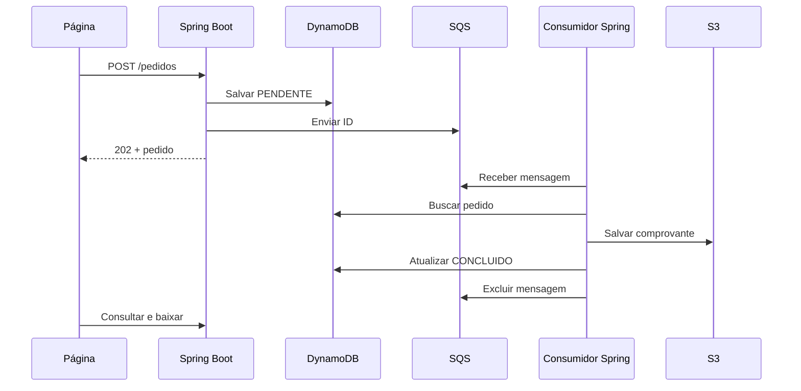

# Workshop · Pedidos assíncronos

Referência para uma aula de duas horas: Java 21, Spring Boot, DynamoDB, SQS e S3 no LocalStack. Os alunos começam no Spring Initializr; somente `src/main/resources/static/index.html` é distribuído pronto.

- [Roteiro da aula](docs/ROTEIRO.md)
- [Extensão Lambda](docs/LAMBDA.md)
- [Validação e ensaio](docs/VALIDACAO.md)

## Executar a referência

Use JDK 21 no terminal e na IDE, Docker Desktop com containers Linux e conta/token LocalStack. Copie `.env.example` para `.env` e preencha seu token (não versionar).

```powershell
docker compose up -d --wait
docker compose exec localstack awslocal dynamodb create-table --table-name pedidos --attribute-definitions AttributeName=id,AttributeType=S --key-schema AttributeName=id,KeyType=HASH --billing-mode PAY_PER_REQUEST
docker compose exec localstack awslocal sqs create-queue --queue-name pedidos
docker compose exec localstack awslocal s3 mb s3://comprovantes
./gradlew.bat bootRun
```

Abra http://localhost:8080. Em Linux/macOS use `./gradlew`. Os comandos `awslocal` rodam dentro do container, sem configurar credenciais reais na máquina. Execute a criação dos recursos uma vez por ambiente vazio. O Compose não habilita persistência: não dependa dos dados após recriar o container.



## Limites didáticos

Não é um sistema de pagamentos. Não há autenticação, DLQ ou transação entre DynamoDB e SQS. Se a publicação na fila falhar após a gravação, o pedido fica pendente e a requisição falha; o professor pode recuperar reenviando seu ID pela CLI. Em produção, discutir outbox e reconciliação. Mensagens inválidas voltam após a visibilidade de 30 segundos; uma DLQ seria o próximo passo. O arquivo tem chave e conteúdo determinísticos para tolerar entregas repetidas.

Clientes AWS usam endpoint explícito, região `us-east-1` e credenciais fictícias `test`. O material é exclusivamente local.

Referências: [SDK Java com Gradle](https://docs.aws.amazon.com/sdk-for-java/latest/developer-guide/setup-project-gradle.html), [autenticação LocalStack](https://docs.localstack.cloud/aws/getting-started/auth-token/), [Lambda LocalStack](https://docs.localstack.cloud/aws/services/lambda/).
